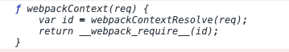
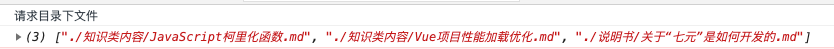
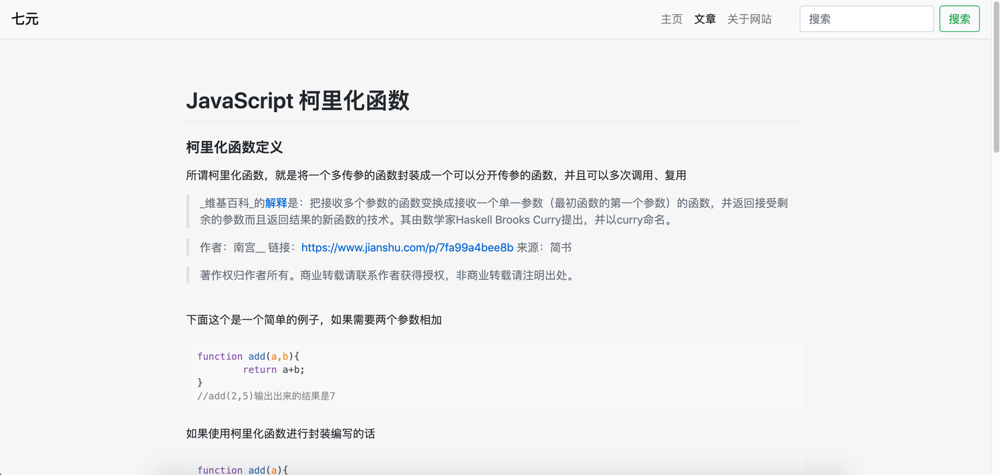

# 关于“七元”是如何开发的

目前网上已经有很多博客建站的框架可供选择，无论是一键建站还是使用一些较为完善的框架。
前端这边之前较为流行的框架有Hexo、gitbook等，最近看到一个vuepress框架，在vue基础上开发的一个基于静态驱动的博客框架。后面上手试了一下，vuepress可以纯靠简单的配置来搭建一个较为完善的博客网站，同时还能介于vue打包之后发布到gitpage上当线上静态博客。
在一番“观察”之后，我觉得可以写一个类似vuepress框架，纯靠配置且前端自动化的一个博客网站，所以就诞生了“七元”。
我将在这个文档介绍一下，我是如何搭建这个博客，且怎么让工程自动化的。
> 网站的整体框架是基于vue开发，同时为了确保轻量、快速，我将不用Element等大型UI框架，改用CDN在线加载Bootstrap样式文件，所以网站的重点在Vue和Markdown上。


---


首先先创建一个简单的vue项目，尽量只使用能用到的东西即可（Scss、Vuex、Router等），创建完成之后我们就按照正常的vue项目开发即可。
目前我们项目的主要目录结构如下（经过筛选）：
|-- src
    |-- App.vue
    |-- main.js
    |-- components
    |   |-- FootBar.vue
    |   |-- NavBar.vue
    |-- docs（重要）
    |   |-- JavaScript柯里化函数.md
    |   |-- Vue项目性能加载优化.md
    |   |-- config.js
    |-- router
    |   |-- index.js
    |-- store（创建项目时可选）
    |   |-- index.js
    |-- util
    |   |-- highlight.js
    |-- views
        |-- Essay.vue
        |-- EssayLists.vue
        |-- Home.vue


和vuepress官方文档上面说的一样：“约定优于配置”，这边也是推荐你使用这样的目录结构，同时docs文件夹内是存放md文件的，只要项目做好自动化配置，你甚至不用打开代码，只需往docs文件夹里面存放文件然后部署即可。


在了解完目录结构之后，我们首先需要知道，单纯的前端是还不能够直接解析markdown文件的，所以我们需要npm install 一个控件，添加前端对markdown文档的一个解析依赖。
```shell
npm install vue-markdown-loader -D
```
安装了markdown-loader之后，我们需要在vue.config配置文件（如果没有的话可以在根目录手动创建一份文件）里面添加依赖
```javascript
chainWebpack: config => {
        config.module.rule('md')
            .test(/\.md/)
            .use('vue-loader')
            .loader('vue-loader')
            .end()
            .use('vue-markdown-loader')
            .loader('vue-markdown-loader/lib/markdown-compiler')
            .options({
                raw: true
            })
    }
```
我们可以先在一个页面上测试一下，项目是否能正常读取markdown文件
```javascript
//导入一篇markdown文件
import MarkDownEssay from '@/docs/xxxx.md'

//在index.js中components引入
export default{
	components: {MarkDownEssay},
}

//在页面上引入即可
<template>
  <mark-down-essay/>
</template>
```
就上面的步骤之后，便可正常加载一边markdown文件
添加上自适应css类，在组件外面包裹一层类即可
```css
.markdown-body {
    box-sizing: border-box;
    min-width: 200px;
    max-width: 980px;
    margin: 0 auto;
    padding: 45px;
	}
```


但是我们会发现这个markdown和我们正常能看到的markdown文件样式不太一样，那么我们需要添加一个高亮处理的js
```shell
npm install highlight.js
```
然后再util目录下新建一个highlight.js文件
```javascript
// highlight.js  代码高亮指令
import Hljs from 'highlight.js';
import 'highlight.js/styles/tomorrow-night.css'; // 代码高亮风格，选择更多风格需导入 node_modules/hightlight.js/styles/ 目录下其它css文件

let Highlight = {};
// 自定义插件
Highlight.install = function (Vue) {
	// 自定义指令 v-highlight
	Vue.directive('highlight', {
		// 被绑定元素插入父节点时调用
		inserted: function(el) {
			let blocks = el.querySelectorAll('pre code');
			for (let i = 0; i < blocks.length; i++) {
				Hljs.highlightBlock(blocks[i]);
			}
		},
		// 指令所在组件的 VNode 及其子 VNode 全部更新后调用
		componentUpdated: function(el) {
			let blocks = el.querySelectorAll('pre code');
			for (let i = 0; i < blocks.length; i++) {
				Hljs.highlightBlock(blocks[i]);
			}
		}
	})
};

export default Highlight;

```
```javascript
//main.js

import Highlight from './util/highlight'

Vue.use(Highlight);
```
在vue文件下使用即可，那么我们就能看到一个正常的markdown文件了
```html
<mark-down-essay v-highlight/>
```


---


在上面的目录结构中，我们知道了只要在docs文件夹中新建目录，往新建的目录文件夹中添加自己的md文件，最后在category.js中配置一下目录结构即可让项目在页面中自动生成目录结构和文章列表内容。


那我们如何只添加文件，使工程自动化？就要了解一下 "require.context" 。


在config.js文件中可以看到，我写了3个公共的方法


其中“getFiles”方法中，使用require.context来获取config.js同目录下的所有.md文件


> 针对require.context的内容可以参考一下MDN的官方说明
> 其中需要传入的3个参数含义如下
> - 要搜索的文件夹目录
> - 是否搜索文件夹其子文件夹内容（即子目录）
> - 匹配文件的正则表达式


方法获取到files内容之后，还并不是一个具体的文件数组信息，require.context只是返回一个文件函数


则获取具体的内容也有相关的3个参数：

- resolve 匹配具体文件，返回这个文件相对工程的相对路径


- keys 返回匹配成功的文件名字（数组Array）


- 执行环境的id,返回的是一个字符串




```javascript
let files = require.context('./', true, /\.md$/);

console.log(files.keys()); //返回文件内容Array
console.log(files.resolve(files.keys()[0])); //返回第一份文件的相对路径
console.log(files.id); //返回相对应的id字符串
```


运用了require.context来获取相对应的文件具体信息之后，这边使用每个文件的相对路径，来匹配目录名字，看这份文件是对应的哪个目录下，那我们将文件储存于Vue代码中的目录对象中即可。


最后我们在文章组件中，使用“getComponent”方法获取到点击的文件相对于的.md文件组件，结合markdown插件便可以直接显示在页面上。



---


## 🎉 写在最后 🎉


因为整个项目追求的是轻便、简介，所以并没有使用其他的UI框架，基本上是能自己写出来的就直接自己写；减少使用多余的JS插件，也是为了加快项目的打包，加快网站的加载加快用户的访问速度。


目前“七元”在开发过程中，还是遇到了不少的困难。😭

项目初期开发的时候，一直在想着怎么能让工程自动化，因为也是参考的Vue-Press来做，所以想着尽量减少操作代码来实现，所以才用上了require.context，目前只要不添加新的目录，只需要在电脑文件夹中往原有目录文件夹丢放文件，项目即可自动识别、加载，同时点击deploy.sh一键打包+部署。🎉


可能你会有疑问，在docs/category.js文件中，已经写了子目录的相关代码，但是为什么没有子目录出来呢？🧐🧐🧐 其实这边本来是做了子目录的相关配置了，也想着后期逐渐完善子目录的配置化，但是在文章列表页中，collapse组件是我自己写的，存在一个问题就是如果配置了子目录，那么点开的时候，最外层的一个折叠层没有自适应高度。如果不需要折叠动画的话，让高度自适应就可以解决这个问题了，但是我想兼容动画所以一直在想最好的解决方案。😙😙😙


🤩如果你喜欢我的这个项目，又或者你对我的项目有什么建议的话，都可以在我的项目github上面star一下和提出issue来让我知道！🥳


> 如果你喜欢，赞助一杯咖啡吧 呜呜呜😭😭
>
> AliPay：     WeChat：

